 

## 👋 About me

**IoT & reliability engineer** building condition-based monitoring (CBM) systems end to end: from the sensor and firmware, through signal processing and machine learning, to the web platform that turns machine data into maintenance decisions.

I like problems where physics, data and software meet, and where "it works on my bench" is not good enough: validated against standards, covered by tests, and documented with the reasoning behind each decision.

## 🔭 What I'm working on

- **Reliability Dashboard** — a web platform for condition monitoring of industrial equipment fleets: per-asset health status, trends, an alarm inbox with hysteresis, and management screens (availability, savings estimator, ROI). Flask + Jinja with server-side rendering, TypeScript modules per page, PostgreSQL, an idempotent alarm engine inside the ingestion transaction, and blocking CI gates. Currently on a 10-phase roadmap toward a Cloud Run deployment and a predictive-maintenance engine.
- **Diagnostics pipeline** — a Python toolkit that turns raw sensor sessions into diagnostics: spectral analysis, robust speed estimation, harmonic profiles, per-setup statistical baselines, and fault hypotheses ranked against a healthy reference. Validated experimentally on a lab test rig.
- **ML study for machine diagnostics** — a benchmark of eight architectures on a public bearing-fault dataset (Isolation Forest, One-Class SVM, LOF, Autoencoder, Random Forest, XGBoost, SVM, MLP) and a two-stage pipeline (anomaly gate → fault classifier) reaching ~99.8% accuracy on the classifier stage. A generic multi-axis industrial template is ready for a real-machine pilot.
- **Robotic inspection platform** (private) — a platform-first demo for autonomous inspection of industrial equipment, where the robot is just one data source behind a port/adapter boundary.

## 🎯 Side projects (built in my free time)

- **V3 AWS Wi-Fi IoT Monitoring** — the cloud-connected evolution of my local sensing firmware (C/C++ with Python tooling), streaming sensor data to AWS over Wi-Fi at the maximum rate the hardware allows.
- **Flight Finder** — a personal flight-price monitor in Python: it queries fares on a schedule, stores the price history in SQLite, and alerts me when a price drops clearly below the norm for a route and date. Built with a pluggable provider design, YAML configuration, and linting/type checks (ruff, mypy, pytest).

## 🧰 Skills & tools

 

| Area | What I use |
|---|---|
| **Languages** | **Python** (primary, incl. MicroPython and Jupyter) · **TypeScript** · JavaScript · **C / C++** · SQL and PL/pgSQL · HTML / CSS (Jinja templates) · Bash / PowerShell · Makefile · Dockerfile |
| **Embedded & IoT** | Microcontrollers (multi-core firmware) · PlatformIO · SPI / I²C · MQTT · filesystems on flash · binary data formats with integrity checks |
| **Signal processing** | Spectral analysis · filtering · feature extraction · time-series · SciPy / NumPy · machine condition-monitoring standards (ISO 13373, 17359, 20816) |
| **Machine learning** | scikit-learn · XGBoost · Autoencoders · Isolation Forest · feature engineering · anomaly detection · transfer-learning trade-offs |
| **Backend & data** | Flask · FastAPI · PostgreSQL · SQLite · Parquet · pandas · REST / SSE · NATS JetStream · OIDC (Auth0) |
| **Architecture** | Hexagonal (ports & adapters) · canonical data contracts · ADRs · multi-tenant access control · idempotent ingestion |
| **DevOps & quality** | Docker · GitHub Actions · pytest / vitest · mypy · Dependabot · security-minded reviews (CSP, CORS allowlists, output escaping) |
| **Cloud** | Google Cloud (Cloud Run / Cloud SQL, in progress) · AWS (Lambda / EC2 / SageMaker, explored for the ML module) |

## 🧪 Selected highlights

- Designed **multi-core acquisition firmware** with a documented binary session format, integrity checks, and host tools for transfer and conversion.
- Built a diagnostic engine with **robust speed estimation** that stays reliable when the dominant signal component is weak, a common failure mode of simple peak-picking in real installations.
- Learned the hard way that **test-setup matters as much as algorithms**: identified when lab artifacts invalidate a diagnostic indicator, and documented the limitation instead of tuning around it.
- Treat architecture decisions as first-class artifacts: **50+ ADRs** for the platform, each with context, decision and consequences.

## 🔒 About my repositories

Most of my projects are in **private repositories** because they involve industrial data and business context that can't be made public. If you'd like more details about any of them (architecture, results, design decisions), **feel free to get in touch** and I'll be happy to walk you through them.

## 🌱 Currently learning / exploring

Predictive maintenance (remaining-useful-life forecasting with prediction intervals), event-driven architectures with NATS JetStream, Cloud Run deployments with automated migrations and rollback, and a native Android client.

## 💬 Ask me about

Condition monitoring · IoT data acquisition · feature engineering for machine health · ML for anomaly detection · designing clean, testable backends.

## 📫 Contact

